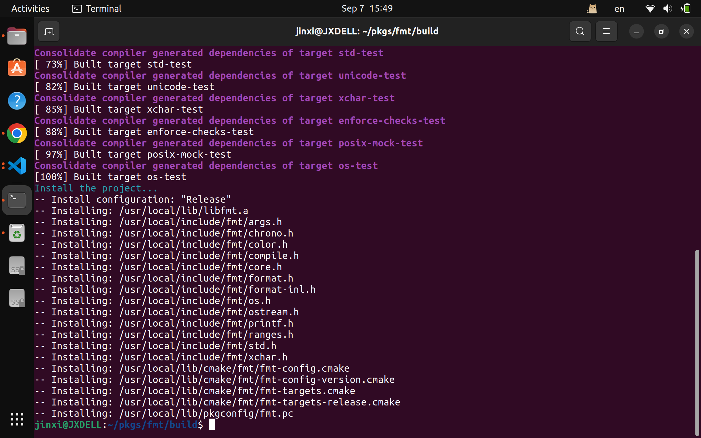
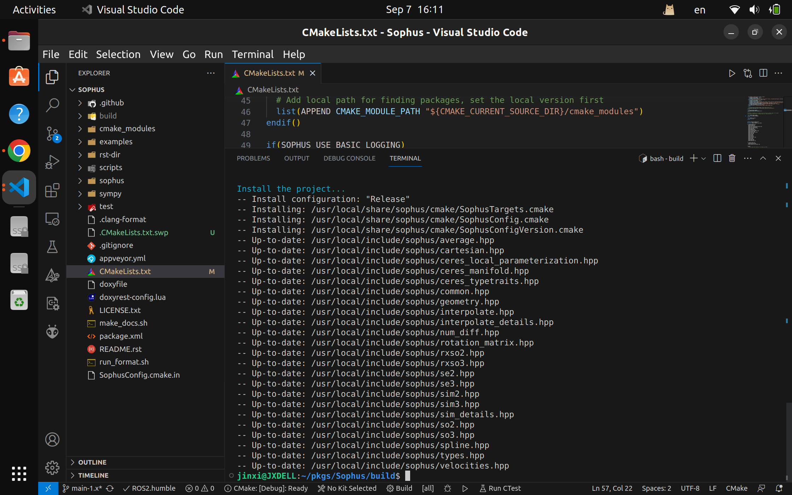

# Notes

## 李代数

>李代数描述了李群的局部性质，准确地说，是单位元附近的正切空间。
>
### $SO(3)$

$$ \mathfrak{so}(3) = \{\phi \in \mathbb{R}^3, \Phi = \phi^\wedge \in \mathbb{R}^{3\times3} \} $$
$$\bold{R} = exp(\phi^\wedge) = \sum_{n=0}^\infty \frac{1}{n!}\bold{A}^n $$
且 $\phi$ 就是**旋转向量**，结合我在ch3中留下的page 54 的问题：
>转轴 $\bold{n}$ 是矩阵 $\bold{R}$ 特征值为1对应的特征向量
>
我相信这些他们之间肯定还有更深层次的联系

## BCH及其近似

$$exp(\Delta\phi^\wedge)exp(\phi^\wedge) = exp((\phi + \bold{J}^{-1}_l)\Delta\phi^\wedge)  $$

## 配置Sophus

在很早的时候（还没开始写这系列blog时），我就有安好它。但是发现之前跟着教程走的时候总是一知半解，都不知道我自己对系统作了什么，特别是那个`make install`。现在我有了一些新的理解，不妨看下面两张图：


`/usr/local` 当我们`make install` 以后，文件就会被复制到这里。那么，以后如果发现冲突，我们就只需要到对应的地方删除对应的file就OK了。\
但是，我们的理解还是非常少，因为之前配置的时候需要库`fmt`，所以这次我们也`install`了。不过，如果我们run `which fmt`，我们发现回答是`/usr/bin/fmt`。 这很有可能就是与`apt` 的冲突了！所以，版本管理真的非常难。

update:

1. in fact we have already installed `fmt` through `sudo apt install libfmt-dev`, so you won't find anything about `fmt` in `/usr/local/`
2. So after this, we need only to cmake `Sophus`, after build, `sudo make install`.
3. based on our own situation, we need to add these in the `CMakeLists.txt`  

```cmake
find_library(Sophus REQUIRD)
target_include_directories(main PRIVATE "/usr/include/eigen3" ${Sophus_INCLUDE_DIRS})
target_link_libraries(main fmt)
```

## 习题

1. 5, 6 需要一些物理理解
2. 学习 `cmake`，推荐一个[workshop](https://enccs.github.io/cmake-workshop/)
3. 在Win10上配置`Sophus`是挺难的，这里不妨看看`sophuspy`，现在Python里面几乎什么都有了
4. 先把一个学`find_package`的[tutorial](https://github.com/BrightXiaoHan/CMakeTutorial/tree/master/FindPackage)放在这里

### Learning CMAKE

这段旅程实在太过艰辛。具体的问题其实可以参考[question](https://stackoverflow.com/questions/77020458/cmake-c-undefined-reference-to-function-name)。~~回过头来仔细思考之后，我认为卡在这里最为根本的问题是我并不清楚整个`CALL`的过程。~~ 其实并不是，那篇问题现在已经closed了，原因其实是在`inline`上，其实与cmake等并没有太大的关系

## Question

1. $\bold{R} = exp(\phi^\wedge)$ 是一直成立的吗？因为在推到过程中存在一阶泰勒的近似，这样会有影响吗？\
Re: 或许李代数本身就是一个局部特征，当我们把李群想象成一个十分光滑的球体，那么李代数就是那局部求导/log之后的东西。更多数学上理解参考[blog](https://www.quora.com/What-are-the-advantages-of-using-Lie-Algebra-and-Lie-Group-in-robotics-and-computer-vision)

2. 求导过程中选择的自变量，及其物理意义（比如扰动模型对 $\log{\Delta\phi}$ 求导）
3. 旋转矩阵的约束使得它在非线性优化时很难优化，为什么不用四元数做优化?\
Re: 其实到最后各种模型的转换都十分容易，我们就不加以区分

4. 深刻理解扰动模型的意义（或许是在后面的优化部分有很重要的意义）
