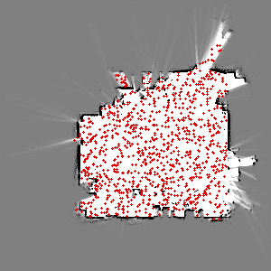

# Explanation of Files

Requirements are in [homework2](./assets/hw2.pdf) and my report is located at [report](./assets/hw2-report.pdf)

```bash
mcl_slam/
├── 2gif.py
├── config.yaml
├── data
│   ├── about.md
│   ├── gridmap.png
│   └── hw2_data
│       ├── hw2_data.db3
│       └── metadata.yaml
├── kld_mcl.py
├── mcl.py
├── README.md
```

1. `2gif.py` converts `.png` images to GIFs.
2. `kld_mcl.py` is the main file for KLD-sampling.
3. `mcl.py` is the main file for MCL.

# Visual Results

<span style="color:red">Red</span> dots indicates particles. <span style="color:blue">Blue</span> lines are the measured rays on the most likely particle. <span style="color:green">Green</span> line is the heading of the most likely particle.

## MCL


## KLD-Sampling



# APIs of `rosbags`

* [laser-scan](https://ternaris.gitlab.io/rosbags/api/stores/ros2_dashing.html#rosbags.typesys.stores.ros2_dashing.sensor_msgs__msg__LaserScan)
* [odom](https://ternaris.gitlab.io/rosbags/api/stores/ros2_dashing.html#rosbags.typesys.stores.ros2_dashing.nav_msgs__msg__Odometry)
* [pose](https://ternaris.gitlab.io/rosbags/api/stores/ros2_dashing.html#rosbags.typesys.stores.ros2_dashing.geometry_msgs__msg__Pose)