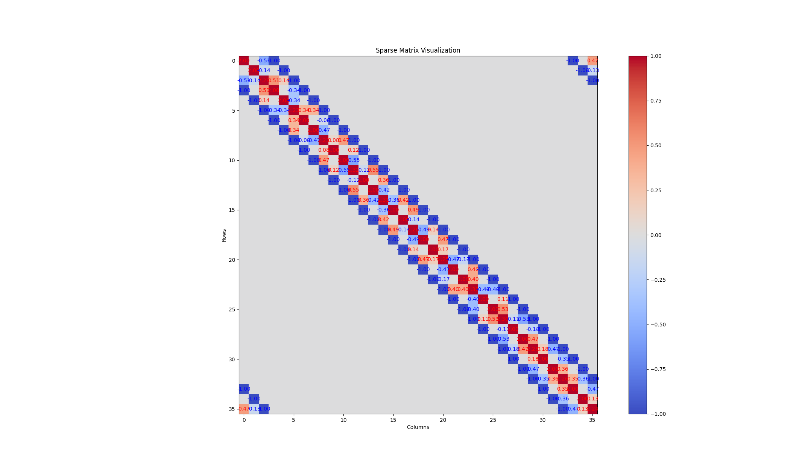

# An Explanation for the project

Requirements are in [homework1](./assets/2024_SLAM_Homework1.pdf) and my report is located at [report](./assets/hw1-report.pdf)

## General structure of this folder

```bash
.
├── 2tum.cc
├── ape.py
├── g2o-optimize
│   ├── CMakeLists.txt
│   ├── cmake_modules
│   │   └── FindG2O.cmake
│   └── g2o_opt.cc
├── gen_gt.py
├── hw1_data.txt
├── information_matrix.txt
├── optimize.cc
├── poses
│   ├── gt_tum.txt
│   ├── opt_tum.txt
│   └── slam_tum.txt
├── readme.md
└── visualize_h.py
```

Notice that the main two files are `optimize.cc` and `g2o_opt.cc`, where the former is the codes of the optimization process built from scratch, and the latter is implemented with `g2o` library.

### Other files or directories
1. `2tum.cc` is used to generate TUM format file of the raw measurement.
2. `ape.py` makes use of the `evo` library to calculate errors of the trajectory.
3. `g2o-optimize` is a directory for g2o codes, including CMakeLists.txt etc.
4. `gen_gt.py` is used to generate ground truth.
5. `hw1_data.txt` is the raw data file
6. `information_matrix.txt` stores the values of the information matrix.
7. `poses` is a directory where some TUM format files are located
8. `visualize_h.py` is used to visualize the information matrix 

## How to Run the code

1. For `optimize.cc`, we can try (**please notice the path of work space**)
   ```bash
   g++ pose-graph/project/optimize.cc -o ./opt -I /usr/include/eigen3/
   ./opt
   ```
2. As for `g2o_opt.cc`, try
   ```bash
    cd pose-graph/project/
    mkdir build && cd build
    cmake ..
    make
    ./graph_optimize
   ```

## To Plot the trajectory

```bash
cd pose-graph/project/poses/
evo_traj tum * --ref gt_tum.txt -p --plot_mode xy
```

## Figures

*I advice directly running codes for results*



